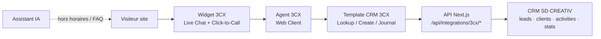

# Plan d’intégration 3CX ↔ CRM — SD CREATIV

> Dernière mise à jour : 20 juillet 2026  
> Cocher `[x]` chaque item dès sa réalisation.  
> Positionnement : **canal relationnel humain** (chat + voix + vidéo équipe), complémentaire à l’**Assistant IA** existant (`ChatWidget`).  
> Cadrage : `src/lib/threecx/cadrage.ts` · socle : `socle.ts` · widget : `widget-config.ts` + `ThreeCxWidget.tsx`  
> Accès : [`CRM-3CX-ACCES.md`](./CRM-3CX-ACCES.md) · Runbook : [`CRM-3CX-PHASE1.md`](./CRM-3CX-PHASE1.md).  
> **Pilote ops (P0)** : checklist condensée [`CRM-3CX-PILOTE.md`](./CRM-3CX-PILOTE.md).

---

## Objectif produit

Offrir aux visiteurs du site un **chat en temps réel** et des **appels audio** via le widget 3CX, et à l’équipe SD CREATIV des **appels audio/vidéo navigateur** (Web Client / meetings) pour les réunions, tout en :

- créant / enrichissant automatiquement les **fiches leads & clients** dans le CRM ;
- journalisant **appels et conversations** ;
- exposant des **statistiques** d’interactions dans le tableau de bord CRM.

### Principes

1. **Humain d’abord** pour la conversion (devis, cadrage) — l’IA reste en première ligne FAQ / hors horaires.
2. **Un seul point d’entrée clair** sur le site (éviter deux bulles concurrentes sans règles).
3. **CRM = source de vérité** commerciale ; 3CX = canal de communication.
4. **RGPD** : consentement, traçabilité, pas d’enregistrement sans cadre légal.

---

## Phase 0 — Prérequis & cadrage

**Décisions MVP (figées dans le code / docs) :**

| Sujet | Décision |
|-------|----------|
| Hébergement | **Hosted 3CX** (FQDN à renseigner en Phase 1 → `THREE_CX_PBX_FQDN`) |
| Licences | Professional/Enterprise Hosted, ≥ 2 agents, Live Chat, Web Client, WebMeeting |
| Horaires | Lun–Ven 8h–18h, fuseau `Africa/Abidjan` |
| UX | **Option A** raffinée Phase 7 — 3CX heures ouvrées + IA coexistence (handoff) ; hors horaires IA + RDV/WhatsApp |
| Files | Accueil commercial `800`, Support technique `801` |
| Accès | Inventaire dans [`CRM-3CX-ACCES.md`](./CRM-3CX-ACCES.md) |

- [x] Choisir l’édition / hébergement 3CX (Hosted 3CX vs self-hosted) et le FQDN PBX  
  *Hosted retenu ; FQDN = placeholder env jusqu’au provisionnement.*
- [x] Valider les licences (extensions agents, Live Chat, WebMeeting selon besoin)  
  *Exigences listées dans `THREECX_LICENSE_REQUIREMENTS` — commande commerciale Phase 1.*
- [x] Définir les **horaires d’ouverture** chat/appel et le message hors ligne  
  *`THREECX_OPEN_HOURS` + messages FR/EN dans `cadrage.ts`.*
- [x] Nommer les **extensions / files d’attente** (ex. Accueil commercial, Support)  
  *`THREECX_QUEUES` + slots agents `100`–`102`.*
- [x] Décider du modèle UX site :
  - [x] Option A : 3CX heures ouvrées + IA coexistence (handoff) — voir Phase 7
  - [ ] Option B : une seule bulle « Contact » qui oriente (chat humain / IA) — *écartée pour le MVP*
  - [ ] Option C : 3CX seul sur pages commerciales, IA sur le reste — *écartée pour le MVP*
- [x] Rédiger la mention cookies / confidentialité (widget + éventuel enregistrement)  
  *Mis à jour dans `src/content/privacy-policy.ts`.*
- [x] Documenter les accès Admin 3CX (Management Console) et comptes agents tests  
  *Template [`docs/CRM-3CX-ACCES.md`](./CRM-3CX-ACCES.md) (à compléter sans secrets).*

---

## Phase 1 — Socle 3CX (hors code CRM)

**Livrable repo (fait)** : runbook [`CRM-3CX-PHASE1.md`](./CRM-3CX-PHASE1.md), blueprint `socle.ts`, `npm run threecx:check`.  
**Livrable ops** : cocher ci-dessous dans la console Hosted, puis renseigner l’env.

| Check env | Variable |
|-----------|----------|
| FQDN | `THREE_CX_PBX_FQDN` |
| Website Link | `NEXT_PUBLIC_THREE_CX_LIVE_CHAT_LINK` |
| Agents ≥ 2 | `THREE_CX_CONFIRMED_AGENTS` |
| Tests T1–T3 | `THREE_CX_CONSOLE_TESTS_PASSED=true` |

- [ ] Provisionner le PBX 3CX et le certificat HTTPS (FQDN valide)  
  *Runbook §1 — cocher après onboarding Hosted.*
- [ ] Créer les utilisateurs agents SD CREATIV + droits Web Client  
  *Runbook §2 — extensions 100–102.*
- [ ] Configurer le **Live Chat** (Website Link / department)  
  *Runbook §4 — destination file **800** ; blueprint `THREECX_PBX_BLUEPRINT`.*
- [ ] Activer **Click-to-Call / appel audio** depuis le widget pour les visiteurs  
  *Runbook §5 — `THREECX_CALL_OPTIONS`.*
- [ ] Configurer WebMeeting / visioconférence navigateur pour l’équipe (réunions internes / clients)  
  *Runbook §6.*
- [ ] Tester : chat → agent, appel audio visiteur → agent, meeting vidéo agent ↔ agent  
  *Runbook §7 — puis `THREE_CX_CONSOLE_TESTS_PASSED=true`.*
- [x] Définir les messages d’accueil FR (et EN si besoin) du widget  
  *`THREECX_WIDGET_COPY` / messages cadrage — à coller dans l’onglet Messages Live Chat.*

---

## Phase 2 — Widget sur le site public

**Livrable repo (fait)** : `ThreeCxWidget` + `widget-config.ts` + intégration `FloatingWidgets` (Option A).  
**Activation prod** : renseigner le lien Live Chat puis `NEXT_PUBLIC_THREE_CX_ENABLED=true`.

- [x] Ajouter les variables d’environnement (`THREE_CX_*` ou équivalent) dans `.env.example`
- [x] Créer un composant dédié (ex. `src/components/chat/ThreeCxWidget.tsx`) chargé côté client
- [x] Brancher le script / snippet officiel 3CX Live Chat (pas d’iframe maison fragile)  
  *`call-us-selector` + `callus.js` (CDN 3CX).*
- [x] Intégrer dans le layout public (FR + EN) avec **condition** horaires / feature flag  
  *Via `FloatingWidgets` (layout racine) — exclut admin / espace-client / présentation.*
- [x] Régler le conflit UX avec `ChatWidget` (Assistant IA) selon l’option choisie en Phase 0  
  *Option A Phase 7 : 3CX + IA coexistence (handoff) ; WhatsApp bascule si 3CX actif.*
- [x] Vérifier mobile (z-index vs WhatsApp flottant / Assistant IA / bouton remonter)  
  *3CX z natif ; WhatsApp / ScrollToTop repositionnés (`dodgeThreeCx`).*
- [x] Pages cibles prioritaires : Accueil, Services, Formations, Contact, Devis, Tarifs  
  *+ `/rendez-vous` et aliases EN — `isThreeCxPriorityPath`.*
- [x] Tester performance (lazy-load du script après interaction ou idle)  
  *`requestIdleCallback` / interaction / fallback 2,5s.*
- [x] Mettre à jour `politique-confidentialite` / cookies si collecte via widget  
  *Fait en Phase 0 (`privacy-policy.ts`).*

---

## Phase 3 — API CRM pour le template d’intégration 3CX

> 3CX interroge le CRM via un **template CRM** (CRM Integration Wizard) : lookup contact, création, journalisation chat/appel.  
> Doc de référence : [CRM Integration 3CX](https://www.3cx.com/docs/crm-integration/).  
> Contrat JSON : [`CRM-3CX-API.md`](./CRM-3CX-API.md).

### Authentification & sécurité

- [x] Créer un token dédié (`THREE_CX_CRM_TOKEN` ou clé API service) — pas le cookie session admin
- [x] Middleware / guard sur `/api/integrations/3cx/*` (Bearer + IP allowlist optionnelle)  
  *`src/lib/threecx/auth.ts` + `THREE_CX_IP_ALLOWLIST`.*
- [x] Logger les appels (sans données sensibles en clair) pour debug
- [x] Rate-limit basique sur les endpoints publics d’intégration  
  *120 req / IP / min via `consumeRateLimit`.*

### Endpoints à exposer (Next.js)

- [x] `GET /api/integrations/3cx/contacts/lookup` — recherche par téléphone **ou** email (Live Chat)
- [x] `GET /api/integrations/3cx/contacts/search` — recherche libre (nom, société, email, tél) pour le Web Client
- [x] `POST /api/integrations/3cx/contacts` — création contact / lead si aucun match
- [x] `POST /api/integrations/3cx/journal/call` — journalisation d’appel (Call Journaling)
- [x] `POST /api/integrations/3cx/journal/chat` — journalisation de conversation Live Chat
- [x] Réponses JSON stables documentées (champs attendus par le template 3CX)  
  *[`CRM-3CX-API.md`](./CRM-3CX-API.md).*

### Mapping métier CRM

- [x] Étendre `LEAD_SOURCES` avec `live_chat_3cx`, `call_3cx` (labels FR dans l’UI)
- [x] Règles de matching :
  - [x] 1) email exact → lead ou client
  - [x] 2) téléphone normalisé (E.164 / digits CI)
  - [x] 3) sinon création lead (`status` approprié, ex. `new`)
- [x] Lier l’activité au **lead** et, si converti, au **client**
- [x] Écrire dans la timeline (`lead_activities` / activité client) un résumé lisible
- [x] Stocker les IDs externes 3CX (call id / chat id) pour idempotence (pas de doublons journal)

### Données à persister

- [x] Migration SQL : table `communication_events`  
  *`migrations/0008_3cx_communications.sql`.*
- [x] Index sur `external_id`, `lead_id`, `client_id`, `started_at`
- [x] Sync `db-init.sql` + migration versionnée `migrations/0008_3cx_communications.sql`

---

## Phase 4 — Template CRM côté 3CX

**Livrable repo (fait)** :
- Template XML PRO : [`integrations/3cx/sdcreativ-crm.xml`](../integrations/3cx/sdcreativ-crm.xml)
- Screen-pop PME : `/admin/crm/3cx-pop` (`src/lib/threecx/screen-pop.ts`)
- Runbook : [`CRM-3CX-PHASE4.md`](./CRM-3CX-PHASE4.md)

### Chemin A — 3CX PME (actuel)

- [x] Screen-pop CRM personnalisé (URL `%CallerNumber%`)  
  *`https://sdcreativ.com/admin/crm/3cx-pop?phone=%CallerNumber%&name=%CallerDisplayName%`*
- [x] Lookup téléphone → fiche lead/client ou création préremplie (`call_3cx`)
- [ ] Ops : coller l’URL dans Réglages → Intégration + tester un appel

### Chemin B — Dédié / PRO (template XML)

- [x] Installer / utiliser le **3CX CRM Integration Wizard**  
  *Template XML prêt ; Wizard optionnel pour tests locaux.*
- [x] Configurer Contact Lookup (numéro + email Live Chat) → endpoints Phase 3
- [x] Activer **Contact Creation** si lookup sans résultat
- [x] Activer **Call Journaling**
- [x] Activer **Chat Journaling**
- [ ] Uploader le template dans Management Console → Settings → CRM  
  *Indisponible sur PME — quand édition PRO.*
- [ ] Tests bout-en-bout PRO (journal auto) :
  - [ ] Chat anonyme → création lead + activité
  - [ ] Chat avec email connu → match client/lead existant
  - [ ] Appel entrant numéro connu → popup / fiche liée
  - [ ] Appel numéro inconnu → nouveau lead
  - [ ] Fin d’appel / fin de chat → entrée journal sans doublon au retry

---

## Phase 5 — Expérience CRM (équipe SD CREATIV)

- [x] Section CRM **Communications** (ou onglet sur fiche lead/client) : historique chat/appels 3CX  
  *`/admin/crm/communications` + `ThreeCxLinkedEventsSection` sur fiches.*
- [x] Deep-link depuis une activité vers la fiche lead/client
- [x] Afficher extension / agent ayant traité l’interaction
- [x] Bouton « Ouvrir Web Client 3CX » (URL configurable) dans le header CRM  
  *`NEXT_PUBLIC_THREE_CX_WEB_CLIENT_URL` ou `https://{THREE_CX_PBX_FQDN}`.*
- [x] Documenter le process réunions : WebMeeting 3CX (lien dans calendrier / RDV)  
  *Runbook [`CRM-3CX-PHASE5.md`](./CRM-3CX-PHASE5.md).*
- [ ] (Optionnel) Click-to-call depuis fiche lead (si API MakeCall / extension agent disponible)
- [x] Permissions CRM : `communications.read` / `communications.write` (ou rattacher à `leads`)

---

## Phase 6 — Statistiques & reporting

- [x] KPI dashboard CRM :
  - [x] Nb chats / jour & semaine
  - [x] Nb appels entrants / sortants
  - [x] Taux de réponse / manqués (si fourni par 3CX ou calculable)
  - [x] Durée moyenne
  - [x] Leads créés via 3CX vs autres sources
  - [x] Conversion lead → devis / client (cohorte source 3CX)  
  *Widget dashboard + panneau Communications / Rapports — [`CRM-3CX-PHASE6.md`](./CRM-3CX-PHASE6.md).*
- [x] Endpoint agrégé `GET /api/admin/reports/communications` (éviter de charger toute la table côté client)
- [x] Filtres période + canal (chat / call)
- [x] Export CSV simple (optionnel)  
  *`/api/admin/reports/communications/export`.*

---

## Phase 7 — Coexistence avec l’Assistant IA

- [x] Règle produit écrite (qui s’affiche quand)  
  *`THREECX_AI_PRODUCT_RULE` + [`CRM-3CX-PHASE7.md`](./CRM-3CX-PHASE7.md).*
- [x] Implémenter le feature flag / horaires dans le layout  
  *`FloatingWidgets` + `resolvePublicCommsMode` (IA toujours + 3CX heures ouvrées).*
- [x] Message IA du type : « Un conseiller est disponible — ouvrir le chat » en heures ouvrées  
  *Mode `handoff` + CTA → événement `sdcreativ:open-threecx-chat`.*
- [x] Hors horaires : IA + prise de RDV (`/rendez-vous`) + WhatsApp  
  *Mode `after_hours` dans `getAiGreeting`.*
- [x] Mettre à jour la page Solutions IA / FAQ si le discours change
- [x] Former l’équipe : handoff IA → humain (quand reprendre un fil)  
  *Playbook `THREECX_AI_HANDOFF_PLAYBOOK` + section formation Phase 7.*

---

## Phase 8 — Qualité, conformité, prod

- [x] Checklist RGPD : finalités, durées de conservation des journaux, DPA hébergeur 3CX  
  *Code + privacy : `compliance.ts` / `privacy-policy.ts`. DPA 3CX Hosted = case ops [`CRM-3CX-PHASE8.md`](./CRM-3CX-PHASE8.md).*
- [x] Mention « conversation peut être enregistrée » si enregistrement activé  
  *`NEXT_PUBLIC_THREE_CX_RECORDING_NOTICE` + `getThreeCxWidgetCopyForConsole`.*
- [x] Secrets uniquement en variables d’environnement / secrets CI  
  *`THREE_CX_CRM_TOKEN` serveur ; garde `threecx:check`.*
- [x] Monitoring Sentry sur `/api/integrations/3cx/*`  
  *`reportThreeCxError` (tag `integration=3cx`).*
- [x] Runbook support : widget ne charge pas, agent offline, lookup échoue  
  *Section 5 de [`CRM-3CX-PHASE8.md`](./CRM-3CX-PHASE8.md).*
- [x] Tests de charge légers (pas de boucle de création de leads)  
  *`npm run threecx:loadtest` — lookup seul.*
- [ ] Déploiement staging → prod + validation métier (1 semaine pilote)  
  *Checklist ops Phase 8 §7 — à cocher après pilote.*

---

## Hors scope (pour l’instant)

- Remplacer WhatsApp Business (garder en parallèle)
- SMS / Facebook Messenger via 3CX (possible plus tard)
- Transcription IA des appels (option 3CX — à évaluer coût / intérêt)
- Softphone desktop obligatoire (Web Client prioritaire)

---

## Fichiers / zones code prévus

| Zone | Fichiers / emplacements probables |
|------|-----------------------------------|
| Widget public | `src/components/chat/ThreeCxWidget.tsx`, `src/app/layout.tsx` |
| Feature flags / horaires | `src/lib/site-public-*` ou settings CRM site |
| API intégration | `src/app/api/integrations/3cx/**` |
| Métier | `src/lib/leads.ts`, `src/lib/clients.ts`, `src/lib/lead-activities.ts`, nouveau `src/lib/communications-3cx.ts` |
| UI CRM | `src/components/admin/CrmCommunicationsView.tsx` (+ nav `crm-nav.ts`) |
| Schema | `migrations/00xx_3cx_communications.sql`, `scripts/db-init.sql` |
| Docs | ce fichier + lien depuis `docs/CRM-AMELIORATIONS.md` |

---

## Critères de « done » (MVP)

- [ ] Widget Live Chat + appel audio opérationnels sur le site en heures ouvrées  
  *Code Phase 2 prêt — activer env + PBX Phase 1.*
- [ ] Un chat / appel crée ou rattache un lead/client dans le CRM
- [x] L’historique apparaît sur la fiche + dans une vue Communications  
  *Phase 5 — journal Phase 3 requis pour peupler.*
- [x] Au moins 4 KPI visibles sur le dashboard  
  *Widget Communications 3CX (Phase 6).*
- [x] Assistant IA ne concurrence pas le chat humain aux mêmes heures  
  *Phase 7 : handoff vers 3CX en heures ouvrées (`FloatingWidgets`).*
- [x] Mentions légales / cookies à jour *(Phase 0 — `privacy-policy.ts`)*

---

## Ordre de mise en œuvre recommandé

1. Phase 0 + 1 (socle 3CX)  
2. Phase 2 (widget site) — valeur immédiate même sans CRM  
3. Phase 3 + 4 (API + template) — automatisation fiches / journal  
4. Phase 5 + 6 (UI CRM + stats)  
5. Phase 7 + 8 (IA, conformité, prod)

---

## Suivi

| Date | Note |
|------|------|
| 19/07/2026 | Plan initial rédigé |
| 19/07/2026 | Phase 0 cadrage implémentée (`cadrage.ts`, accès, privacy, `.env.example`) |
| 19/07/2026 | Phase 1 livrable repo : runbook, `socle.ts`, `npm run threecx:check` — cases console à cocher côté ops |
| 19/07/2026 | Phase 2 widget public : `ThreeCxWidget`, Option A, lazy-load — activation via env |
| 19/07/2026 | Phase 3 API CRM `/api/integrations/3cx/*` + `communication_events` — template XML = Phase 4 |
| 19/07/2026 | Phase 4 complète : XML PRO + screen-pop PME `/admin/crm/3cx-pop` |
| 19/07/2026 | Phase 5 UI CRM : Communications, header Web Client, WebMeeting docs |
| 19/07/2026 | Phase 6 stats : `/api/admin/reports/communications` + widget dashboard |
| 19/07/2026 | Phase 7 coexistence IA ↔ 3CX (handoff + hors horaires RDV/WhatsApp) |
| 19/07/2026 | Phase 8 conformité : Sentry, RGPD, loadtest, runbook — pilote ops ouvert |
| | |
